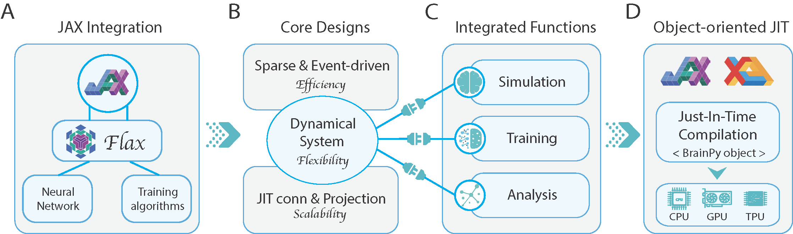
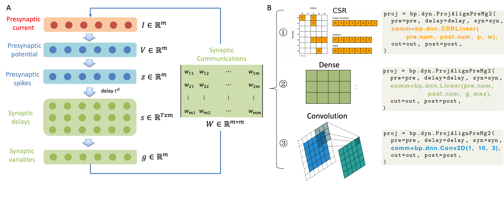

# BrainPy ICLR 2024 paper

This is the official implementation of our ICLR 2024 paper "[A differentiable brain simulator bridging brain simulation and brain-inspired computing](https://openreview.net/forum?id=AU2gS9ut61)".




## Abstract
Brain simulation builds dynamical models to mimic the structure and functions of the brain, while brain-inspired computing (BIC) develops intelligent systems by learning from the structure and functions of the brain. The two fields are intertwined and should share a common programming framework to facilitate each other's development. However, none of the existing software in the fields can achieve this goal, because traditional brain simulators lack differentiability for training, while existing deep learning (DL) frameworks fail to capture the biophysical realism and complexity of brain dynamics. In this paper, we introduce BrainPy, a differentiable brain simulator developed using JAX and XLA, with the aim of bridging the gap between brain simulation and BIC. BrainPy expands upon the functionalities of JAX, a powerful AI framework, by introducing complete capabilities for flexible, efficient, and scalable brain simulation. It offers a range of sparse and event-driven operators for efficient and scalable brain simulation, an abstraction for managing the intricacies of synaptic computations, a modular and flexible interface for constructing multi-scale brain models, and an object-oriented just-in-time compilation approach to handle the memory-intensive nature of brain dynamics. We showcase the efficiency and scalability of BrainPy on benchmark tasks, highlight its differentiable simulation for biologically plausible spiking models, and discuss its potential to support research at the intersection of brain simulation and BIC.

## Requirements
The Python version is 3.10, most of the dependencies can be installed by running:
```
pip install -r requirements.txt
```
If using GPU, please install jax[cuda] version in advance according to the JAX official guide.


## Installation

BrainPy is based on Python (>=3.8) and can be installed on Linux (Ubuntu 16.04 or later), macOS (10.12 or later), and Windows platforms. Install the latest version of BrainPy:

```bash
$ pip install brainpy -U
```

In addition, many customized operators in BrainPy are implemented in ``brainpylib``.
Install the latest version of `brainpylib` by:

```bash
# CPU installation for Linux, macOS and Windows
$ pip install --upgrade brainpylib
```

```bash
# CUDA 12 installation for Linux only
$ pip install --upgrade brainpylib-cu12x
```

```bash
# CUDA 11 installation for Linux only
$ pip install --upgrade brainpylib-cu11x
```

## Citation
If this paper has been significant in your research, and you would like to acknowledge the project in your academic publication, we suggest citing the following papers:
```bibtex
@misc{wang2023differentiable,
      title={A differentiable brain simulator bridging brain simulation and brain-inspired computing}, 
      author={Chaoming Wang and Tianqiu Zhang and Sichao He and Yifeng Gong and Hongyaoxing Gu and Shangyang Li and Si Wu},
      year={2023},
      eprint={2311.05106},
      archivePrefix={arXiv},
      primaryClass={cs.NE}
}
```


## Usage
All the files are organized in the following structure:
```
Submit_code
├── README.md
├── requirements.txt
├── 5.1_EI_balanced_network
│   ├── COBAlif
│   ├── COBAHH
│   ├── speed_result_HH
│   ├── speed_result_lif
│   ├── result_anaylze_HH.py
│   ├── result_anaylze_LIF.py
├── 5.1_operators_comparison
│   ├── operators_comparison.py
├── 5.2_jitop_comparison
│   ├── jit_conn_comparison.py
├── 5.2_reservoir_computing
│   ├── reservoir.py
│   ├── kth-reservoir-force-training.py
│   ├── mnist-reservoir-force-training.py
│   ├── run-KTH.sh
│   ├── run-mnist.sh
├── 5.2_jitop_for_large_scale_EI
│   ├── scaling_COBA_LIF.py
├── 5.3_working_memory
│   ├── utils.py
│   ├── spiking_version.py
│   ├── rate_version.py
├── appendix_auto-syn-merging
│   ├── large_scale_EI.py
│   ├── Joglekar_2018_data
├── appendix_spiking_neural_network_training
│   ├── BrainPy_fashion_mnist.py
│   ├── Norse_fashion_mnist.py
│   ├── snnTorch_fashion_mnist.py
│   ├── SpikingJelly_fashion_mnist.py
│   ├── brainpy_VGG-SNN.py
├── compilation_of_multiarea_net
│   ├── brainpy_code.py
│   ├── brian2_code.py
├── compilation_time_of_EI_net
│   ├── brainpy_COBAlif.py
│   ├── brian2_COBAlif.py
│   ├── run_brian2.sh
├── dmnet_with_parallel_computing
│   ├── decision-making-tpu.ipynb
```

### 5.1: EI balanced network
EI balance network with LIF can be simulated by running:
```
python brainpy_COBAlif.py
```
EI balance network with HH can be simulated by running:
```
python brainpy_COBAHH.py
```

### 5.1: Operators comparison
The operators comparison can be simulated by running:
```
python operators_comparison.py
```

### Section 5.2: JIT operators comparison
The JIT operators comparison can be simulated by running:
```
python jit_conn_comparison.py
```

### Section 5.2: Reservoir computing
In order to run the reservoir computing, the KTH dataset and the MNIST dataset should be downloaded in advance. 
The KTH dataset can be downloaded from [here](https://paperswithcode.com/dataset/kth) and the MNIST dataset can be downloaded from [here](http://yann.lecun.com/exdb/mnist/).
The KTH dataset and the MNIST dataset should be placed in the `5.2_reservoir_computing` folder.

The model trained on KTH dataset can be run by:
```
bash run-KTH.sh
```

The model trained on MNIST dataset can be run by:
```
bash run-mnist.sh
```

### Section 5.2: JIT operators for large scale EI
The large-scale E/I balanced network using JIT operators can be simulated by running:
```
python scaling_COBA_LIF.py
```

### Section 5.3: Working memory
The spike version of working memory can be simulated by running:
```
python spiking_version.py
```
The rate version of working memory can be simulated by running:
```
python rate_version.py
```

### Appendix: auto synapse merging
The large-scale E/I balanced network can be simulated by running:
```
python large_scale_EI.py
```

### Appendix: Spiking neural network training
The spiking neural network training can be simulated by running:
```
python BrainPy_fashion_mnist.py
```